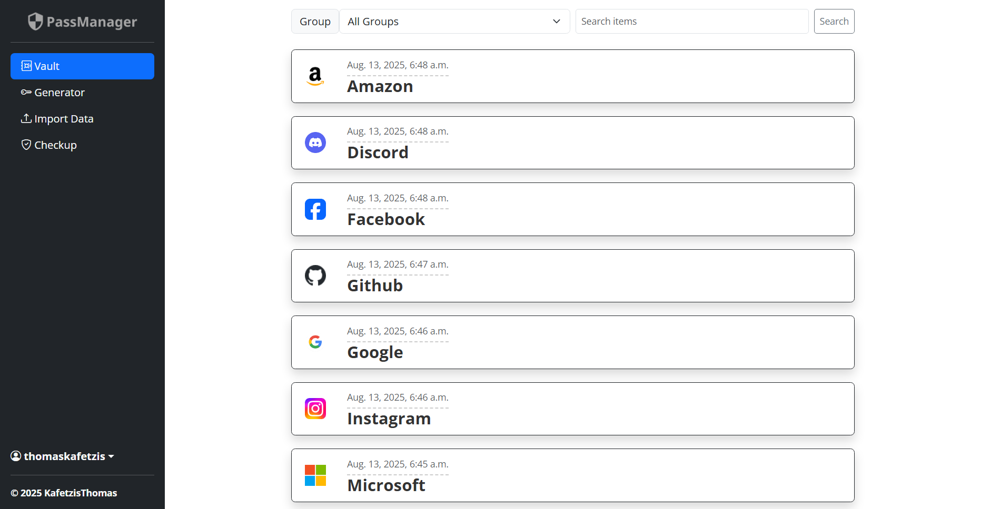
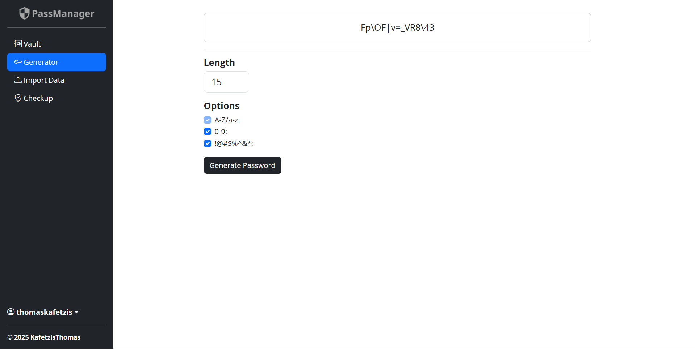
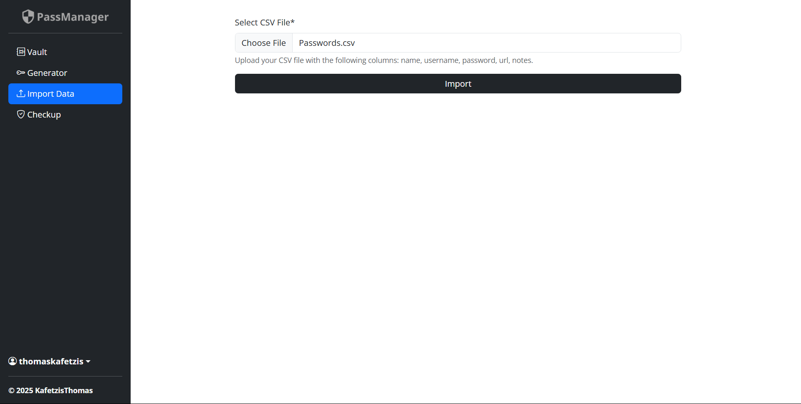
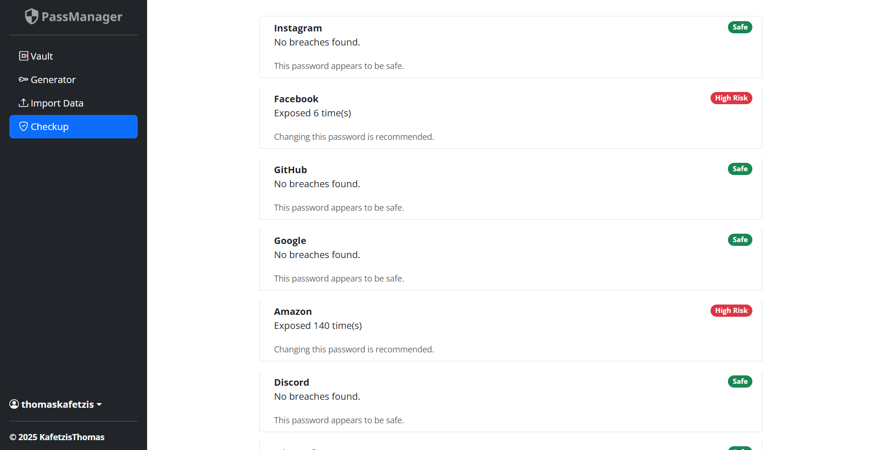
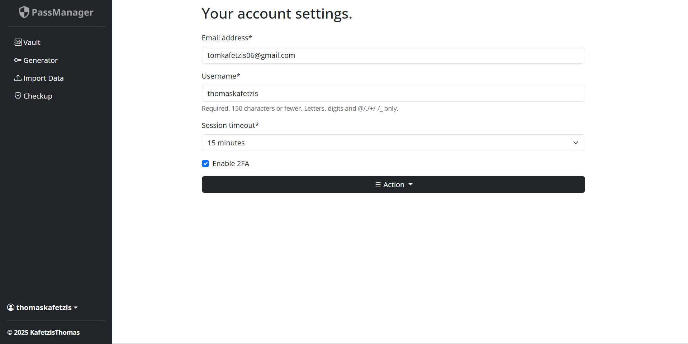
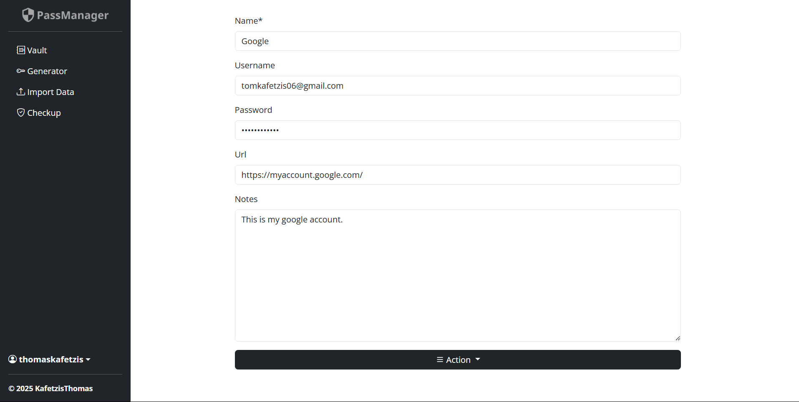
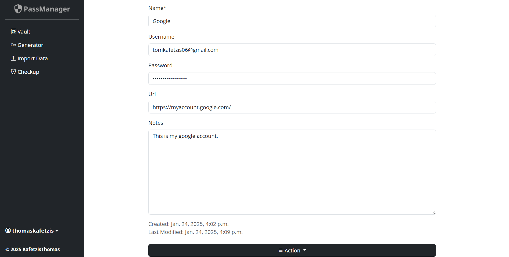

<div align="center">
    <h1>
        
    </h1>
    <p>Self-hosted password manager for secure online credentials.<br>Written in Python/Django</p>
    <a href="https://github.com/KafetzisThomas/PassManagerWeb/actions/workflows/tests.yml">
        
    </a>
    
</div>

---

## Features

- [X] **AES-256 GCM Encryption**: Each user's data is encrypted using a **unique encryption key** derived from their `master password` and a user-specific `salt`, ensuring isolation between accounts.
- [X] **Multi-Factor Authentication**: Protect your account with your favorite authenticator app.
- [X] **Password Generator Tool**: Built-in tool to generate `strong`, `random` passwords, with `customizable` options (length, character types).
- [X] **Password Health Monitoring**: Built-in tool to check the strength and health of stored passwords, identifying `weak`, `reused`, or `compromised` passwords.
- [X] **Import/Export Data**: `Upload` data such as passwords from a CSV file or `download` your stored data in `CSV` format for easy backup or migration.
- [X] **Automatic Logout**: Automatically logs you out after a **customizable** period of inactivity. Choose the **timeout** duration that best suits your needs.

## Purpose

The primary goal of this project is to **provide a self-hostable,  open-source password manager that anyone can use and learn from**.
While the app is available for use, my main intention is not to attract active users or compete with major applications like [Bitwarden](https://bitwarden.com/).
Instead, I aim to offer a self-host option for those who prefer full control over their password management and to share the code, primarily written in Django, for educational or personal use.

If you find this project interesting, helpful, or inspiring, please consider giving a `star`, `following`, or even `donating` to support further development.

## Setup for Local Development

### Set up Virtual Environment

```bash
➜ cd path/to/root/directory
$ python3 -m venv env/
$ source env/bin/activate
```

### Install Dependencies

```bash
$ pip3 install -r requirements.txt
```

### Create Enviroment Variable file

```bash
$ touch main/.env
$ nano main/.env
```

Add the following environment variables (modify as needed):
```bash
# Django settings
➜ SECRET_KEY="example_secret_key"  # https://stackoverflow.com/a/57678930
➜ ALLOWED_HOSTS="localhost,127.0.0.1"
➜ CSRF_TRUSTED_ORIGINS="http://localhost:8001"
➜ DEBUG=True  # For development

# OPTIONAL: PostgreSQL Configuration (remote production)
➜ DATABASE_URL="postgres://[username]:[password]@[host]:[port]/[db_name]"

# Email settings
➜ EMAIL_HOST_USER="example_email_host"
➜ EMAIL_HOST_PASSWORD="example_email_password"
```

Save changes and close the file.

> **Note:** You can deploy the application using Docker:  
> **NGINX + Gunicorn + External DB**  
> ```sh
> $ docker compose up
> ```

### Migrate Database

```bash
$ python3 manage.py migrate
```

### Run Django Server
```bash
$ python3 manage.py runserver
```

Now you can access the website at `http://127.0.0.1:8000/` or `http://localhost:8000/`.

## Run Tests

```bash
➜ cd path/to/root/directory
$ python3 manage.py test
```

## Demo Images

<div align = 'center'>
    <h2>Vault</h2>
    
    <br><h2>Password Generator</h2>
    
    <br><h2>Import Data</h2>
    
    <br><h2>Password Checkup</h2>
    
    <br><h2>Account Settings</h2>
    
    <br><h2>New Item</h2>
    
    <br><h2>Edit Item</h2>
    <br>
</div>

## Contributing Guidelines

### Pull Requests
* **Simplicity**: Keep changes focused and easy to review.
* **Libraries**: Avoid adding non-standard libraries unless discussed via an issue.
* **Testing**: Ensure code runs error-free, passes all tests, and meets coding standards.

### Bug Reports
* Report bugs via GitHub Issues.
* Submit pull requests via GitHub Pull Requests.

Thank you for supporting PassManager!
