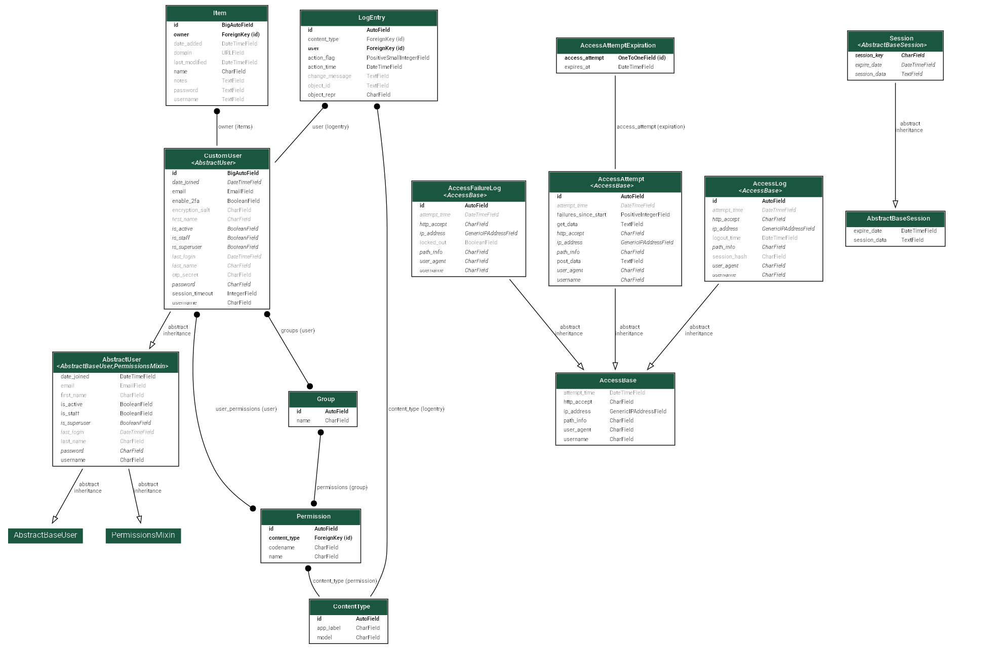
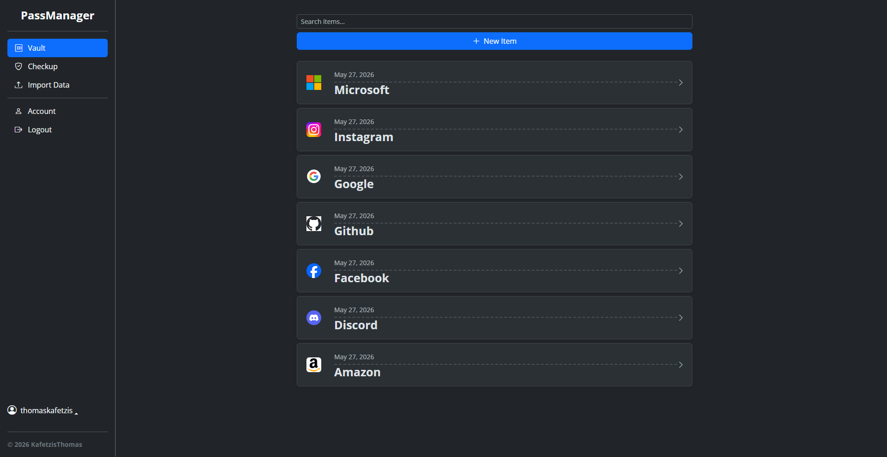
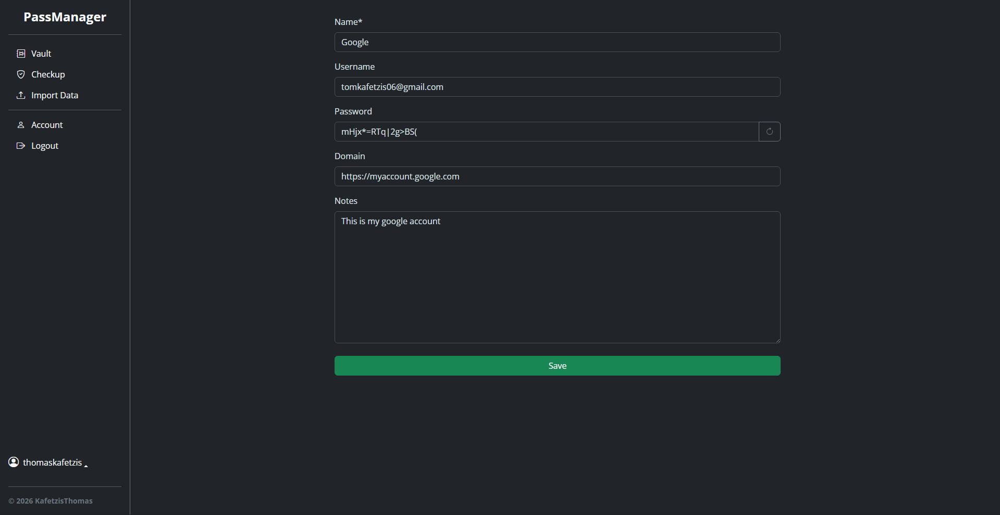
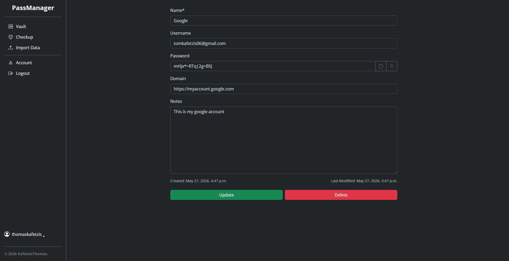
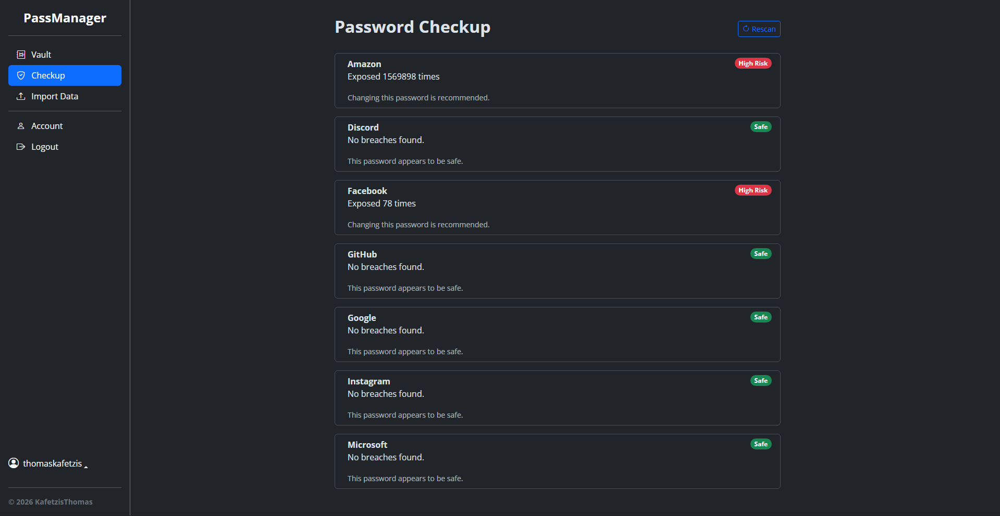
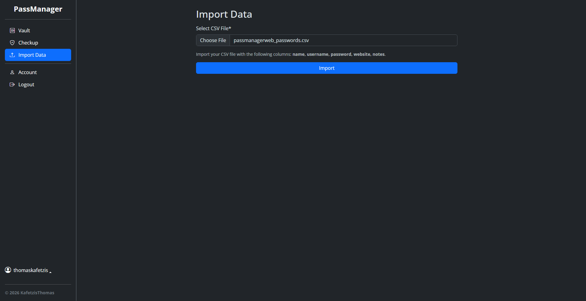
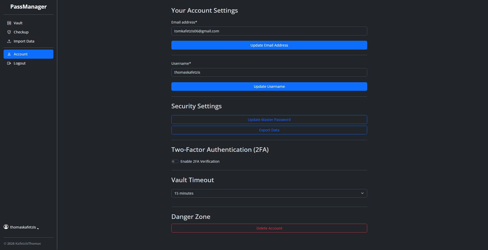

<div align="center">
    <br><br>
    <p>Self-hosted password manager for secure online credentials.<br>Written in Python/Django</p>
    
    
</div>

## Features

- [X] **AES-256 GCM encryption** with per-user keys derived from the `master password` and `salt`
- [X] **Multi-factor authentication** for extra account protection
- [X] `Create`, `read`, `update` and `delete` vault items
- [X] Vault **search**
- [X] Detect `weak` passwords across your vault
- [X] `Import` and `export` vault data in csv format
- [X] Configurable vault **timeout** with automatic locking
- [X] Brute force login protection with **rate limiting**
- [X] Automated **discord webhook** alerts for new account registrations

## Database Schema



## Purpose

The primary goal of this project is to **provide a self-hostable,  open-source password manager that anyone can use and learn from**.
While the app is available for use, my main intention is not to attract active users or compete with major applications like [Bitwarden](https://bitwarden.com/).
Instead, I aim to offer a self-host option for those who prefer full control over their password management and to share the code, primarily written in Django, for educational or personal use.

## Usage

### Local Development

First install `uv` and sync the project dependencies:

```bash
cd path/to/root/directory
pip install uv
uv sync
uv sync --extra dev  # for devs only
```

Migrate database:

```bash
uv run manage.py migrate
```

Run Django server:

```bash
uv run manage.py runserver
```

Access web application at `http://127.0.0.1:8000` or `http://localhost:8000`.

### Production Deployment (Docker)

Set up your environment variables:

```bash
cp .env.prod .env
nano .env  # modify file, instructions inside
```

Build and start the container in the background:

```bash
docker compose up -d --build
```

Access web application at `http://127.0.0.1:8000` or `http://localhost:8000`.

## Run Tests

```bash
uv run manage.py test
```

## Demo Images













## Contributing Guidelines

### Pull Requests

- **Simplicity**: Keep changes focused and easy to review.
- **Libraries**: Avoid adding non-standard libraries unless discussed via an issue.
- **Testing**: Ensure code runs error-free, passes all tests, and meets coding standards.

### Bug Reports

- Report bugs via GitHub Issues.
- Submit pull requests via GitHub Pull Requests.

Thank you for supporting PassManager!
