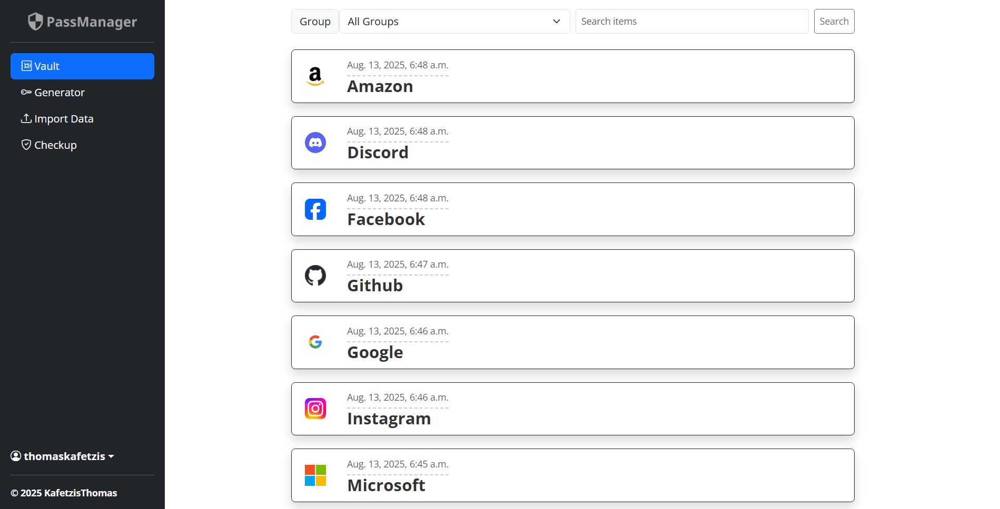
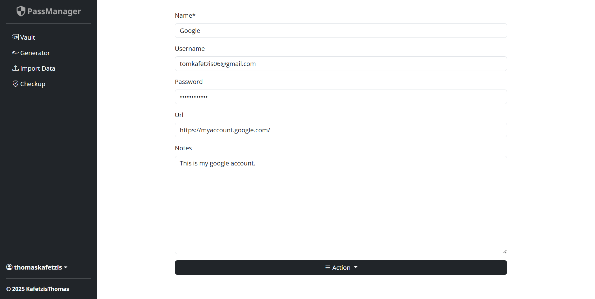
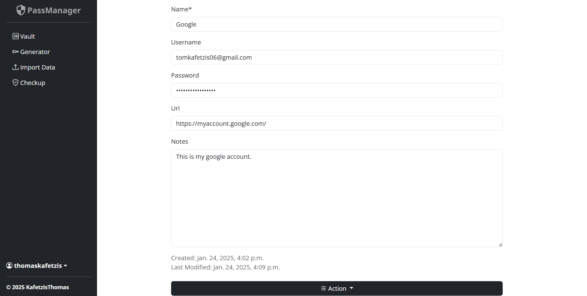
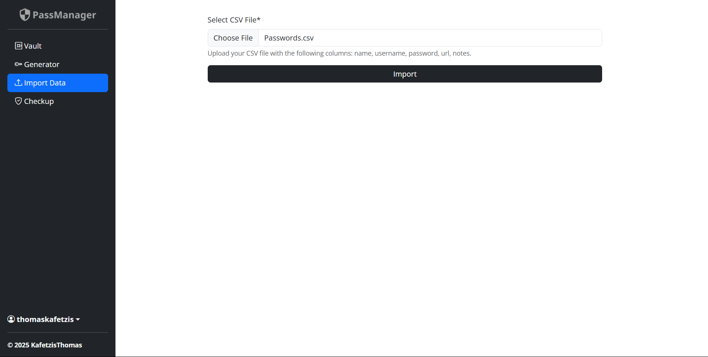
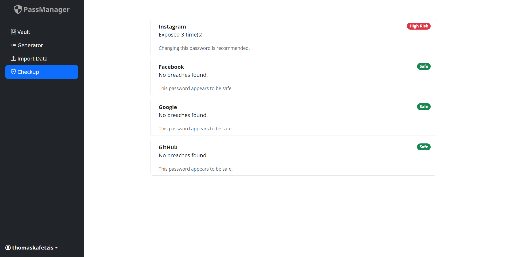
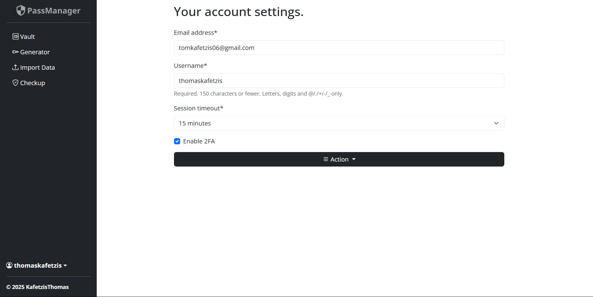

<div align="center">
    <br><br>
    <p>Self-hosted password manager for secure online credentials.<br>Written in Python/Django</p>
    
    
</div>

> [!IMPORTANT]
> **This project has evolved into [LockBox](https://github.com/KafetzisThomas/LockBox).**
> LockBox represents the next generation of this application featuring a **zero-knowledge architecture**, **client side encryption** and a high performance **FastAPI** backend. Active development continues there.

## Features

- [X] **AES-256 GCM Encryption**: Each user's data is encrypted using a **unique encryption key** derived from their `master password` and a user-specific `salt`, ensuring isolation between accounts.
- [X] **Multi-Factor Authentication**: Protect your account with your favorite authenticator app.
- [X] **Password Health Monitoring**: Built-in tool to check the strength and health of stored passwords, identifying `weak`, `reused`, or `compromised` passwords.
- [X] **Import/Export Data**: `Upload` data such as passwords from a CSV file or `download` your stored data in `CSV` format for easy backup or migration.
- [X] **Automatic Logout**: Automatically logs you out after a **customizable** period of inactivity. Choose the **timeout** duration that best suits your needs.

## Database Schema


## Purpose

The primary goal of this project is to **provide a self-hostable,  open-source password manager that anyone can use and learn from**.
While the app is available for use, my main intention is not to attract active users or compete with major applications like [Bitwarden](https://bitwarden.com/).
Instead, I aim to offer a self-host option for those who prefer full control over their password management and to share the code, primarily written in Django, for educational or personal use.

If you find this project interesting, helpful, or inspiring, please consider giving a `star`, `following`, or even `donating` to support further development.

## Usage

### Local Development

First install `uv` and sync the project dependencies:

```bash
cd path/to/root/directory
pip install uv
uv sync
```

Migrate database:

```bash
uv run manage.py migrate
```

Run Django server:

```bash
uv run manage.py runserver
```

Access web application at `http://127.0.0.1:8000` or `http://localhost:8000`.

### Production Deployment (Docker)

Set up your environment variables:

```bash
cp .env.prod .env
nano .env  # modify file, instructions inside
```

Build and start the container in the background:

```bash
docker compose up -d --build
```

Access web application at `http://127.0.0.1:8000` or `http://localhost:8000`.

## Run Tests

```bash
uv run manage.py test
```

## Demo Images













## Contributing Guidelines

### Pull Requests

- **Simplicity**: Keep changes focused and easy to review.
- **Libraries**: Avoid adding non-standard libraries unless discussed via an issue.
- **Testing**: Ensure code runs error-free, passes all tests, and meets coding standards.

### Bug Reports

- Report bugs via GitHub Issues.
- Submit pull requests via GitHub Pull Requests.

Thank you for supporting PassManager!
